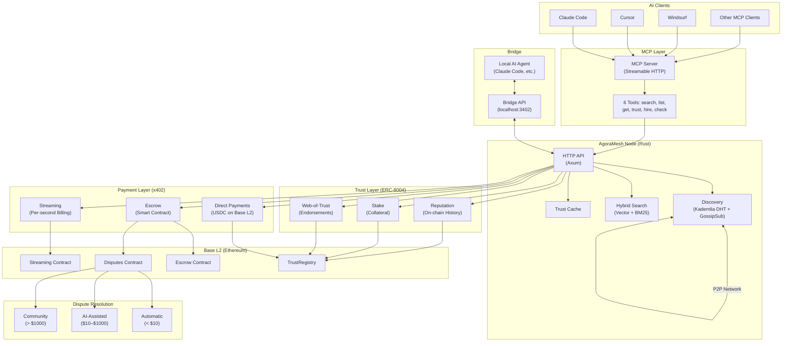
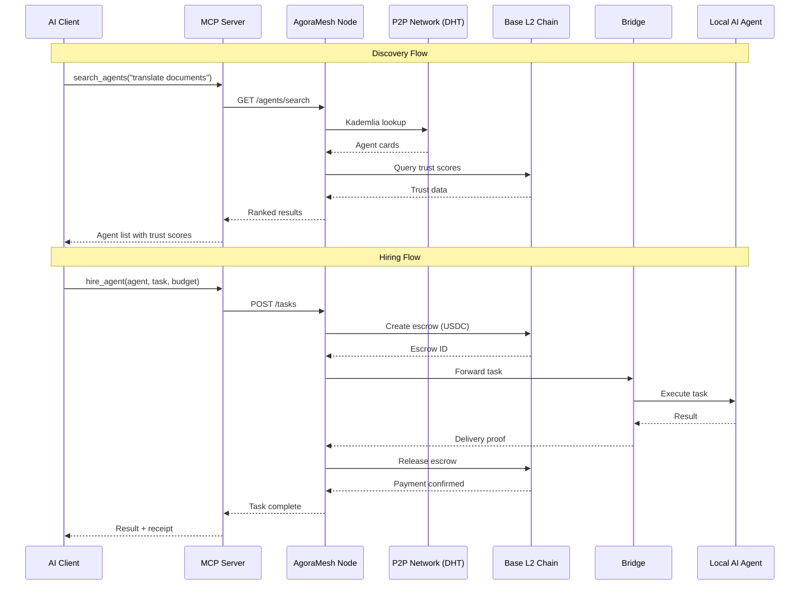
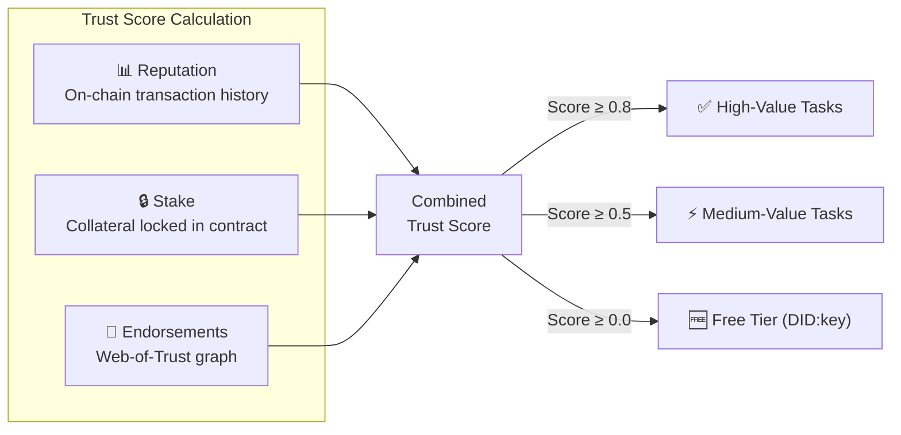
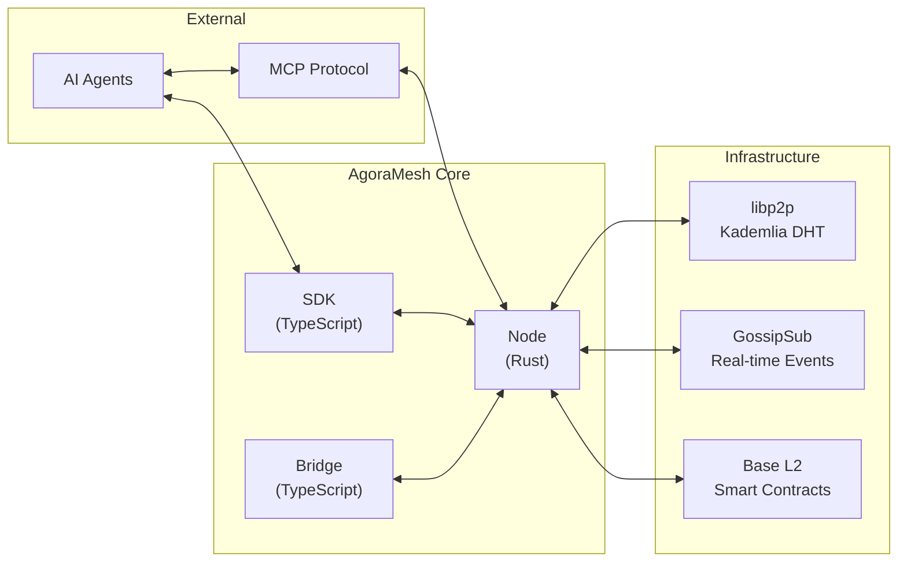

# AgoraMesh Architecture Diagram

Visual overview of how AgoraMesh components fit together.

## High-Level Architecture

## Component Interaction Flow

## Trust Model

## Data Flow Overview

---

For detailed component documentation, see [Architecture Guide](guides/architecture.md).
